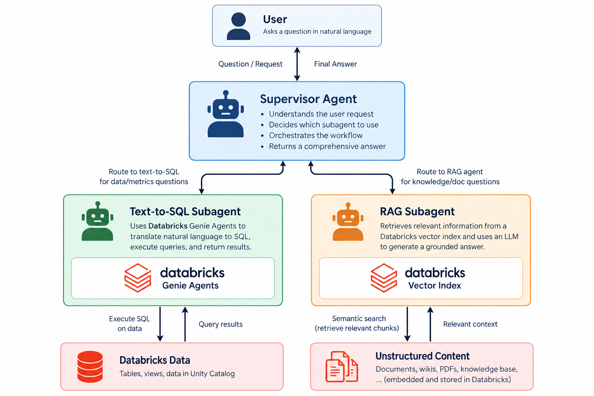

# Databricks Agentic Development Workshop

Follow the workshop by reading the instructions and executing the cells in **workshop_instructions_notebook**.

This repository implements a workshop to build a multi-agent system on Databricks. It is designed to be used in conjunction with agentic coding via Databricks Genie. The repository contains synthetic data generation code to persist Delta tables and configure a Databricks Genie Agent for text-to-sql. It also contains example pdf documents and a workflow to parse, chunk, and embed the documents before feeding them into a Databricks Vector Index. 

The Databricks Genie Agent and Vector Index are then combined into a supervisor agent architecture that can references these sources to answer users questions.

## What You'll Build

* **Synthetic data** — GlowMart retail tables in Unity Catalog
* **Genie Space** — text-to-SQL over the business data
* **Vector Search index** — parsed and chunked PDF documents
* **LangGraph supervisor** — coordinates a Genie agent and a RAG agent to answer questions from both sources

